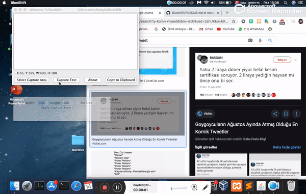

# BlueShift OPENSOURCE OCR SOFTWARE

Ümit Aksoylu 2020 © M.I.T  Lisansı



BlueShift, kopyalanamayan formattaki yazıların otomatik metine dönüştürülmesini amaçlayan bir java masaüstü programıdır. 
BlueShift sayesinde kopyalama izni vermeyen bir web sayfasından içerik alabilir, görselleri yazıya dönüştürebilirsiniz.


MacOSX, Linux, Unix ve Windows işletim sistemlerinde aşağıdaki yönergeler ile sorunsuzca çalıştırılabilir.
## Gerekli Kütüphanenin Kurulumu

### OSX :
Tesseract OCR kütüphanesi sisteme kurulu olmalıdır. Bunun için terminal açılır ve 
```bash
brew install tesseract
```
ile tesseract kütüphanesi yüklenir. Eğer sistemde Brew paket yöneticisi yok ise
https://brew.sh/
bu sayfadaki adımlar ile kurulabilir

### Linux :
Sistemin mevcut paket yöneticisi her ne ise tesseract kütüphanesi kurulmalıdır. Örneğin debian için
```bash
sudo apt-get install tesseract
```
eğer tesseract kütüphanesi dağıtımınız için yok ise 
```bash
sudo apt-get install tesseract-ocr-tur
```
kurulabilir.

### Windows :
Herhangi bir ek çabaya gerek yoktur. Windows klasöründeki proje sorunsuz çalışacaktır. Eğer bir sorun oluşursa projenin netbeans'te açılıp tess4j dll dosyalarının tekrar ef edilmesi yeterli olacaktır.

## Netbeans olmadan SADECE çalıştırmak için
Yukarıdaki kütüphane kurulumunu yaptıktan sonra executable klasörüne girin,
```bash
java -jar "BlueShift.jar"
```
komutunu terminalden çalıştırın.

Not: Proje kodlarında düzenleme yapacaksanız Netbeans ide ile açmanız size kolaylık sağlar

==============================================================================

Ümit Aksoylu 2020 © M.I.T License

BlueShift is a java desktop program that aims to automatically translate text that cannot be copied into text.
Thanks to BlueShift, you can take content from a web page that does not allow copying, and convert the images to text.

It can be run smoothly on MacOSX, Linux, Unix and Windows operating systems with the following instructions.

### OSX:
Tesseract OCR library must be installed on the system. For this, the terminal opens and
`` `Bash
brew install tesseract
`` `
The tesseract library is loaded with. If there is no Brew package manager in the system
https://brew.sh/
can be installed with the steps on this page

### Linux:
Whatever is the current package manager of the system, the tesseract library should be installed. For example debian
`` `Bash
sudo apt-get install tesseract
`` `
### Windows:
No additional effort is required. The project in the Windows folder will run smoothly. If there is a problem, it will be enough to open the project in netbeans and re-eject tess4j dll files.


